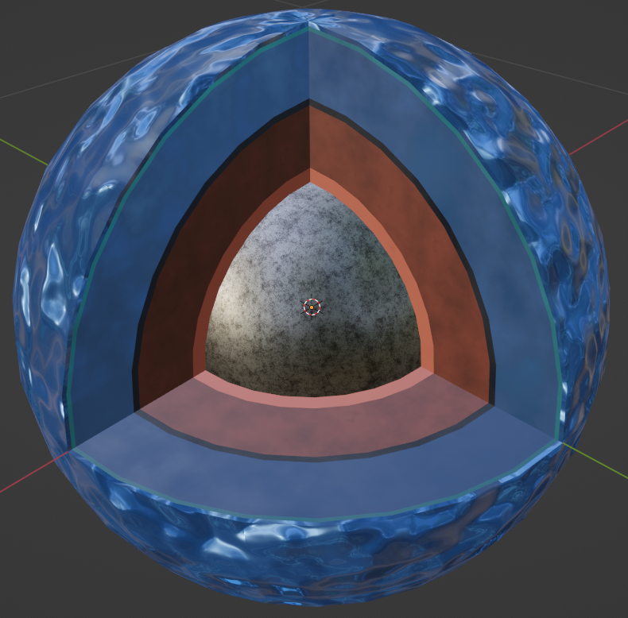

# Blender-Magrathea
Blender 3D planet builder: Takes in Magrathea outputs and automatically builds realistic and appealing 3-D interior models

 

 

Step-by-Step Instruction:
1. Donwload Blender: https://www.blender.org/download/
2. Once Openend - under New File press General
3. In top bar select Scripting
4. At the top of the new pop up window select New - this will create a new Text window
5. Copy and paste code from Blender_Code.py into this new text window
6. Grab file path of Magrathea output file. Instructions to do that are here: https://www.sony.com/electronics/support/articles/00015251
7. On line 17 Replace text inside of the file_name variable (only replace the text in between the quotation marks) with the file path of desired Magrathea output file
8. Press the Run Script button at top right of Text/Code window
9. In the top bar press "Layout"
10. Interior of planet should be complete now!
